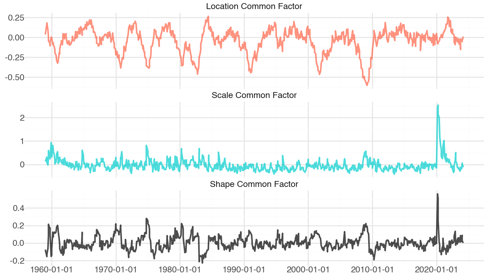

# ScoreJAX

JAX (Bradbury et al. 2018) implementation of the score-driven model
featuring location, scale and shape common factors introduced in Labonne
P. (2024). “Asymmetric uncertainty: Nowcasting using skewness in
real-time data”. *International Journal of Forecasting*

JAX adds automatic differentiation and high-performance numerical
computing features to code written in Python.

#### First install all necessary python libraries

``` python
%%capture

! pip install -r requirements.txt
```

#### R code for building a dataframe from fred-md vintages. The dataframe is saved in the `arrow` `parquet` format for easy interoperability with Python.

``` python
%%capture

# first install all necessary packages
! Rscript "R/install.R"

# build the dataframe
! Rscript "R/fredmd.R"
```

#### Load the dataframe in `Python`

``` python
import pyarrow.parquet as pq

# load the data
df = pq.read_table("data/df_fredmd.parquet").to_pandas()

df
```

<div>
<style scoped>
    .dataframe tbody tr th:only-of-type {
        vertical-align: middle;
    }
&#10;    .dataframe tbody tr th {
        vertical-align: top;
    }
&#10;    .dataframe thead th {
        text-align: right;
    }
</style>

|     | date        | INDPRO    | CE16OV    | CUMFNS    | DPCERA3M086SBEA | PAYEMS    | RETAILx   | RPI       | UNRATE    |
|-----|-------------|-----------|-----------|-----------|-----------------|-----------|-----------|-----------|-----------|
| 0   | 1959.083333 | 1.738279  | -0.612898 | 1.481509  | 0.966960        | 0.438704  | 0.169163  | 0.110199  | -0.224538 |
| 1   | 1959.166667 | 1.230835  | 1.193374  | 1.230779  | 0.848629        | 0.808025  | 0.234181  | 0.329129  | -0.686613 |
| 2   | 1959.250000 | 1.906412  | 0.990503  | 1.801505  | -0.782696       | 0.741097  | -0.261192 | 0.333689  | -0.917651 |
| 3   | 1959.333333 | 1.295589  | -0.339024 | 1.099839  | 1.179025        | 0.488271  | 0.200892  | 0.273098  | -0.224538 |
| 4   | 1959.416667 | -0.082853 | 0.170076  | -0.170418 | 0.126977        | 0.175401  | 0.281956  | 0.041557  | -0.224538 |
| ... | ...         | ...       | ...       | ...       | ...             | ...       | ...       | ...       | ...       |
| 777 | 2023.833333 | 0.162480  | 0.367459  | 0.363541  | 0.189933        | -0.042583 | -0.233764 | 0.113831  | -0.224538 |
| 778 | 2023.916667 | -0.510677 | -0.815139 | -0.086090 | 0.244151        | 0.073831  | -0.067334 | -0.044320 | 0.006500  |
| 779 | 2024.000000 | -0.981633 | -0.207511 | -1.174170 | -0.724201       | 0.036609  | -1.001622 | 0.295708  | 0.006500  |
| 780 | 2024.083333 | 0.242271  | -0.350544 | 0.961427  | 0.273061        | 0.051226  | 0.350324  | -0.271700 | 0.468575  |
| 781 | 2024.166667 | 0.190687  | 0.286488  | 0.323452  | 0.312425        | 0.086174  | 0.152310  | -0.056672 | -0.224538 |

<p>782 rows × 9 columns</p>
</div>

#### Estimation with maximum likelihood

``` python
import sys
sys.path.append('src') # to find sdfm
from sdfm import build_model
from sdfm import mle

import jax
import jax.numpy as jnp
from jax import random

# convert the data to a JAX type
df_np = df.to_numpy() # for easy use with JAX
y = jnp.array(df_np[:, 1:])

# build the model
slack_model = build_model(y)

# estimation with maximum likelihood
key = jax.random.PRNGKey(123)
mle_result = mle(model=slack_model, iter=50, pertu=0.25, key=key)

print("ML at", -mle_result.fun)
```

    ML at -4198.79052734375

#### Run the filter with the estimated parameters

``` python
from sdfm import sd_filter
estimated_filter = sd_filter(mle_result.x, slack_model)
```

#### Plot of the estimated common factors



<div id="refs" class="references csl-bib-body hanging-indent">

<div id="ref-jax2018github" class="csl-entry">

Bradbury, James, Roy Frostig, Peter Hawkins, Matthew James Johnson,
Chris Leary, Dougal Maclaurin, George Necula, et al. 2018. “JAX:
Composable Transformations of Python+NumPy Programs.”
<http://github.com/google/jax>.

</div>

</div>
